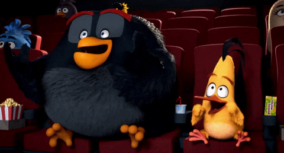

# Movie Recommendation System

### Try the final project at -
<a href = "https://movie-system-dorbee.herokuapp.com/">Click Here</a>

## 💡 Inspiration

Movies have always been a significant part of entertainment in our history, and particularly in 
this current world, which is undergoing a pandemic, movies have played a significant role in 
helping people relax their minds. However, after watching a film, the next significant question 
is "WHAT NEXT?" It's the most perplexing issue that practically everyone has, and I've made 
this project to address it. In this project, I'll make a movie recommendation system based on 
what the user watches. This model will employ a content-based filtering mechanism to provide 
the user with recommended movies and inform them about comparable films based on their 
choices.

## 🧑‍💻 How does it Works ?

How does it decide which item is most similar to the item user likes? Here we use the similarity scores.It is a numerical value ranges between zero to one which helps to determine how much two items are similar to each other on a scale of zero to one. This similarity score is obtained measuring the similarity between the text details of both of the items. So, similarity score is the measure of similarity between given text details of two items. This can be done by cosine-similarity.

